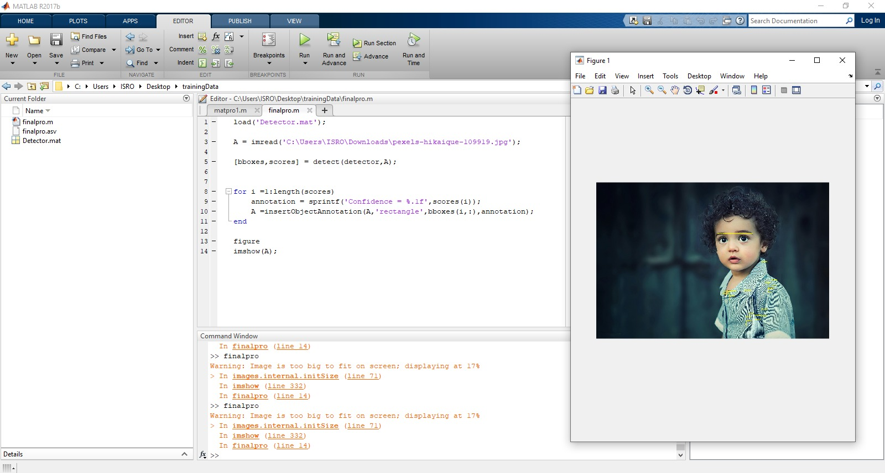

# Face Detection using MATLAB

## 📌 Overvie

This project demonstrates a basic face detection system using MATLAB.
It detects human faces in an image and draws bounding boxes with confidence scores.

---

## ⚙️ Methodology

* ROI labeling using MATLAB Image Labeler
* Dataset creation with manually annotated faces
* Training using ACF (Aggregate Channel Features) Object Detector
* Detection using MATLAB `detect()` function

---

## 🛠️ Technologies Used

* MATLAB
* Computer Vision Toolbox
* ACF Object Detector

---

## 📂 Project Structure

```
Face-Detection-MATLAB/
│── README.md
│── face_detection_main.m
│── helper_function.mat
│── sample_images/
│── results/
```

---

## ▶️ How to Run

1. Open MATLAB
2. Run `face_detection_main.m`
3. Input image will be processed
4. Faces will be detected with bounding boxes

---

## 📊 Results



---

## 🤝 Contributors

* Sachin Upadhyay
* Nenavath Prakash

---

## 🚀 Future Improvements

* CNN-based face detection
* Real-time webcam detection
* YOLO / Deep Learning models

---

## 📌 Note

This project is a basic implementation for learning computer vision concepts.
